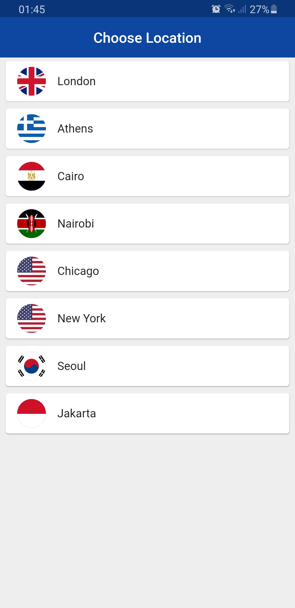

# Cubit World Time App

A [Flutter](https://flutter.dev/) application for retrieving json data from API made with [Cubit](https://pub.dev/documentation/flutter_cubit/latest/).
Also used to have advance [Navigator](https://api.flutter.dev/flutter/widgets/Navigator-class.html) class functionality (check [initial commit](https://github.com/JollyGoal/flutter_world_time/commit/3617bfc8c1b0121126646e1cb405a11381a7afab)).

[Download APK](release/world-time.apk)


## External Packages
```
dependencies:
  intl: ^0.16.1
  http: ^0.12.2
  flutter_spinkit: ^4.1.2
  bloc: ^6.0.0
  flutter_bloc: ^6.0.0
  flutter_launcher_icons: ^0.8.1
  flutter_launcher_name: ^0.0.1
```

## Demo GIF


[Download preview demo.mp4](release/demo.mp4)


## Screenshots

|Pick Screen|Daytime Screen|Night Screen|
|---|---|---|
||||

